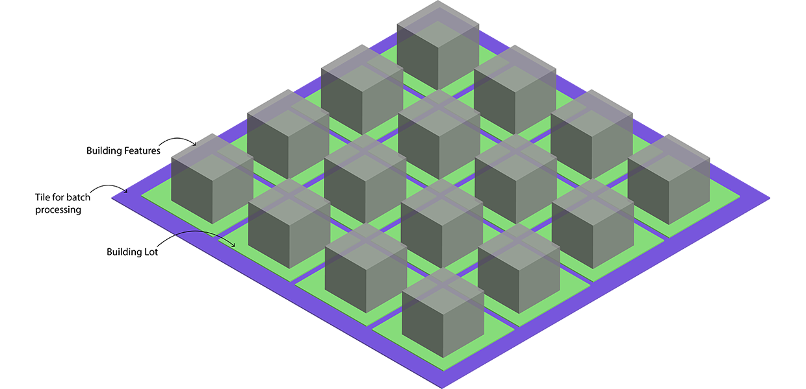
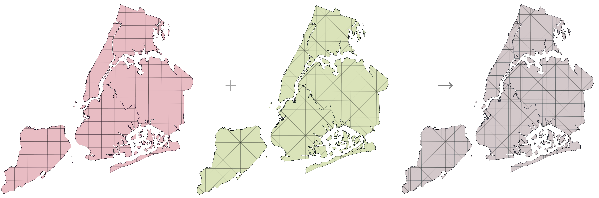
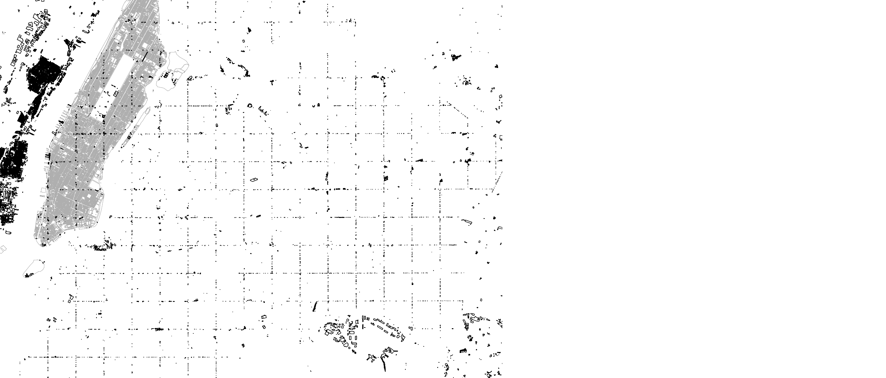

# Multi-thread Spatial Merge
## Node.js + Turf.js + MongoDB
Multi-threaded Node JS script to spatially join attributes between two GeoJson datasets

[Spatial merge](http://www.qgistutorials.com/en/docs/performing_spatial_joins.html) can be a really tedious process if the datasets are quite large. It can take up to [several hours](https://geonet.esri.com/thread/76151) if not days. 

The trick to successfully implement a fast spatial join is either work on GPU ([1](http://geoteci.engr.ccny.cuny.edu/pub/pipsp_tr.pdf),[2](http://www.nvidia.com/object/what-is-gpu-computing.html)) that requires expertise in GPU computing or distribute the processing load to multiple threads. The latter improves performance by utilising multiple cores availabe on a machine.

This algorithm written in pure Javascript distributes the processing load [Node.js Cluster API for multi-threading](https://nodejs.org/api/cluster.html), coupled with batch processing the data on each thread. The geographical analysis is done using [Turf.js Library](http://turfjs.org/). The data is stored and processed from a [mongoDB](https://www.mongodb.com/) database. It can join 2.5 million features and 650,000 features in two layers in nearly 2 hours (*Tested on Intel i7-6700HQ CPU @ 2.60Hz, 16GB RAM, Windows 10*).




### Process Overview:
Consider the two images above. One of the dataset has building features and can be regarded as *inner layer*. The buildings are always inside a building-lot. The other dataset has lot features and can be regarded as *outer layer*. We split both of the datasets in *tiles* for batch processing. Each tile contains multiple lot features and within each lot there are multiple building features.

#### Laying out tile grid
- The features in both inner and outer layer are clipped to city boundaries.
- The area inside city boundaries is divided into two sets of grids - square tile and triangular tile
Two sets of grids are necessary to perform the spatial merge in batches of two separate non-identical tiles. Otherwise, after a single pass some salt-n-pepper features are left along the boundary of the tiles. The tile grid structure is explained with the images below.

	
	**City Boundary**

	
	**Square & Triangle Grid**
	
	
	** Leftover features at the intersection of square tiles which need to be accounted for using triangle tiles**

#### Matching tiles
- Next, the tile ID is added to each feature within the respective tile.
- The tiles are then sent to each working thread for performing the spatial merge. 
- Each thread looks at features within the tile alloted to it and runs a the spatial join.
- This process is makes it faster because each thread only scans features within a tile, instead of the whole map. This is made possible by adding tile IDs to each feature in advance.


---

### Spatial Join:  Open Map Tiles Buildings and MapPluto Lots

In this case the two datasets to be merged are : 
- [Open Map Tiles: 3D buildings, 2.5 million features](https://openmaptiles.os.zhdk.cloud.switch.ch/v3.3/extracts/new-york_new-york.mbtiles)
- [MapPluto Dataset : City Lots 675,000 features](https://www1.nyc.gov/site/planning/data-maps/open-data/dwn-pluto-mappluto.page)

#### Preparation and Conversion:
- Convert both datasets to geoJson Files
	- Use Tippecanoe-decode to convert [.mbtiles to geojson](https://github.com/mapbox/tippecanoe#tippecanoe-decode)
	- Use ogr2ogr to convert [.shp to geojson](http://gis.stackexchange.com/questions/68175/geojson-to-esri-shapefile-using-ogr2ogr)
- Import both datasets as Json files to individual collections in a Mongodb database. Local instance should be fine. Refer to detailed documentation regarding data conversion and importing [here](https://github.com/UrbanSystemsLab/data-pipeline-newYork/wiki/Database#import-geojson-features-to-mongodb)


#### Database Collections
- Setup the MongoDB database
- Import data to Open Map Tiles data to `buildings` collection and MapPluto Lots data to `lots` collection.
- Import city boundary data to `cityBoundary`
- The `squareGrid` and `triangleGrid` is created by the `init.js` and running 'step 1.'
- Modify `config.json` values to describe database and collection names. 

```js

// MongoDB Collection Structure

`nycdb` collections
|
|- buildings	// Open Map Tiles Buildings
|- lots // MapPluto Lots
|- cityBoundary // City Boundary to clip non-intersecting features
|- squareGrid // Batchwise spatial merge for muti-threaded process
|- triangleGrid	// Batch processing, second pass
```

#### Verify config.json


#### Run

- Install Dependencies

```sh
npm install # Install dependencies
npm start
```

- Start Mongo Daemon

```sh
mongod
```

- Run `node init.js` and follow the steps listed sequentially.

```
Spatial-Join

Enter the step number to execute:
1.	Create tile girds for batch processing (required for next steps)
2.	Clip inner & outer layer features to city boundary
3.	Link inner & outer layer features to tile grids
4.	Spatial Merge: Add outer layer properties to inner layer properties

```

#### Future Enhancements:
- Create a GUI interface in [Electron](https://electron.atom.io/)
- Run it in cloud on higher thread count
- Create a docker container
